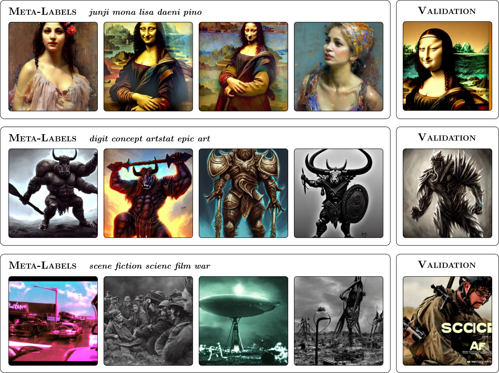

# Meta-label Extraction for Diffusion Model Image



## About

We propose a fully automatic toolkit that (1) groups images with semantically similar content; and (2) extract
precise descriptions of each group—which we refer to as meta-labels.

## Setup

With Virtual environment:

Ensure you have python 3 installed.

Create a virtual environment, activate it, and install dependencies:
```sh
$ python -m venv .venv
$ source .venv/bin/activate
$ pip install -r requirements.txt
```

## Usage

To run the grid search for hyperparameter tuning.
```
$ python main.py --parameter-tuning --topks 1 2 3 
```

To show distance generative plot.
```
$ python main.py --topks 1 2 3 --plot_types distance --inp_sample_size 3 --sd_sample_size 3
```